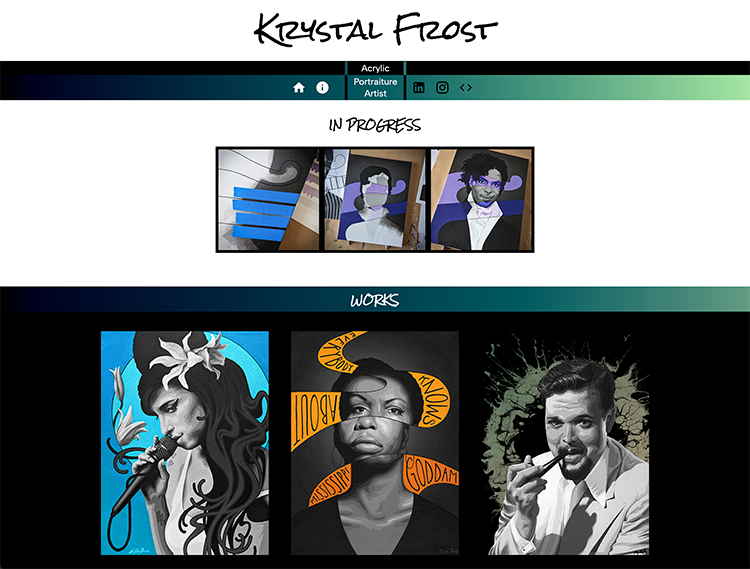

# Hello!

I'm Krystal Frost.  This is my personal website to showcase my artwork.

The deployed site can be visited [here!](https://www.galleryoffrost.com/)

## Screenshot

## Prerequisites

This app was built with Node, React, and Material UI (and a full list of dependencies can be found in `package.json`).

Before you get started, make sure you have the following software installed on your computer:

- [Node.js](https://nodejs.org/en/)
- [Nodemon](https://nodemon.io/)

## Install Instructions

- Run `npm install`
- Run `npm run server`
- Run `npm run client`
- Navigate to `localhost:3000` in your browser.

## Usage

The first section of the homepage shows my latest work.

The second section on /home showcases previous artworks.

On the left side of the nav bar, there are white internal navigation icons for /home and /about. Click the second to go to /about where you will find a short bio and a fun bonus: the "Random Thing I Like Generator"! Click the button on the generator to see a randomly generated thing I like. Do this as many times as YOU like.

On the right side of the nav bar, black icons link to external locations: my LinkedIn profile, my Instagram account where I post art-in-progress, and a code icon linking to a sister site, which features my software engineering projects. The repo for that site can be found [here](https://github.com/librarykrystal/portfolio) and the deployed site visited [here](https://www.krystalfrost.com/).

## Contributors
Krystal Frost — [librarykrystal](https://github.com/librarykrystal)

## License
This project is licensed under the MIT License - see the LICENSE.md file for details.

## Acknowledgments
Thanks to Prime Digital Academy (and especially my instructor, Casie Siekman), as well as to all who have supported my artistic endeavors.