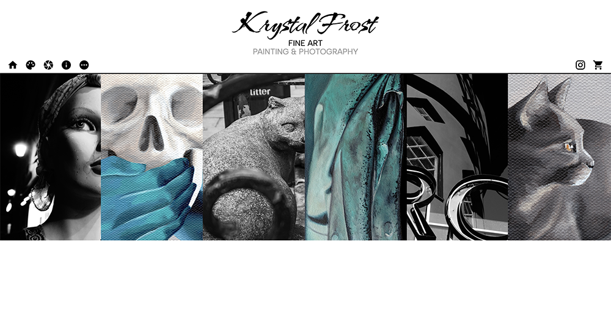

# Hello!

I'm Krystal Frost.  This is my personal website to showcase my artwork.

The deployed site can be visited [here!](https://www.galleryoffrost.com/)

## Screenshot

## Prerequisites

This site was built with Node, React, and Material UI (and a full list of dependencies can be found in `package.json`).

Before you get started, make sure you have the following software installed on your computer:

- [Node.js](https://nodejs.org/en/)
- [Nodemon](https://nodemon.io/)

## Install Instructions

- Run `npm install`
- Run `npm run client`
- Navigate to `localhost:3000` in your browser.

## Usage

On the left side of the nav bar, there are white internal navigation icons.  Clicking on them routes you around the site as follows:

- The HOME icon navigates back to the welcome collage.
- The PALETTE icon navigates to the paintings page.
- The APERTURE icon navigates to the photographs page.
- The INFO icon navigates to an "About the Artist" page.
- The ELLIPSIS icon navigates to a "Work in Progress" page.

On the right side of the nav bar, icons link to external locations: my Instagram profile (where you may find additional in-progress painting updates) and my Etsy shopfront.

## Contributors
Krystal Frost — [librarykrystal](https://github.com/librarykrystal)

## License
This project is licensed under the MIT License - see the LICENSE.md file for details.